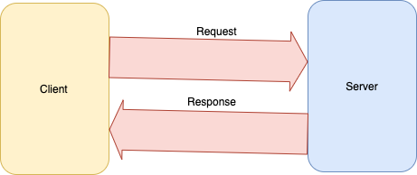
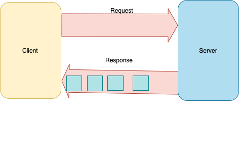
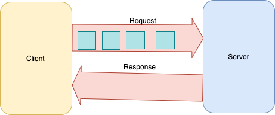
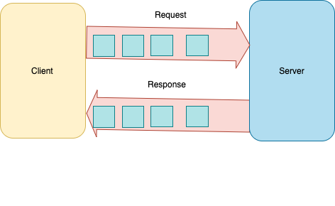

# grpc-do-playground

Contains examples of grpc with go. All the four API mechanisms, Unary, Server Streaming, Client Streaming and Bi directional Streaming are covered here. 

## Unary 
Unary is the simplest form and one which most developers are familiar with. This is the standard Request Response mechanism provided by REST

## Server Side Streaming 
This is the API style where the client sends a single request and the server responds with a stream of response. Consider the example of finding the prime factors of a number. In this case the client sends a single request with the number fow which the prime factors need to be computed. The server responds with a stream of prime factors as it computes them. 

## Client Side Streaming 
This is the API style where the client sends a number of requests and the server responds with a single response. Consider cases where you need to compute an aggregate sum/running averages over time etc. There is no guarantee that the server will respond only after it has received all the requests from the client. The server may respond as and when it chooses. Thats something which as a developer you need to keep in mind.

## Bi Directional Streaming 
This is the API style where the client sends a number of requests and the server responds with a number of responses. The number of requests and responses dont have to match. You could send 10 requests and maybe receive just 3 responses. Use when the client and server need to send a lot of data asynchrnously like cases where you need long running connections. 

## grpc error codes
 
 Refer to https://grpc.io/docs/guides/error/
          http://avi.im/grpc-errors/#go
 

